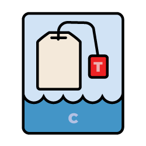

# Teas and Seas (Beta)

A set of Terms and Conditions (T's and C's) that are easy to use, and fair for your customers.

## What is it, and why?

**Terms and Conditions are a pain, and nobody reads them anyway.**

It takes too long to read terms and conditions, and they are not well understood. This collection of universal, pre-written T's&C's are designed to be easy to assemble and easy to consume.

Developers know their software licenses by shorthand acronyms, like MIT, GPL, BSD, etc. These are generally well understood because they are consitent across projects and their intent is known even without re-reading the text.

This project aims to do the same for Terms and Conditions.

The project will be a success if a large set of people come to know that, say, "P2" level privacy refers to a site, service or software that collects data incidently -- and may use cookies -- but does not try to idenitfy you individually or combine data for re-use or sale to third parties. 

## How to use

Each of the T's and C's sections are ordered in levels from one to nine. 

Just browse through the texts and use the ones you need.

There are high-level, single-letter sections which are designed to be best for general understanding and use. These are simply a combination of all of the subsections at the same level.

For instance, you could include Privacy collection level two ([PC2](texts/PC2-Privacy-collection-level-two.md)), privacy discosure level one (PD1), etc. But if all your Privacy terms are at level two, just use [P2](texts/P2-Privacy.md).